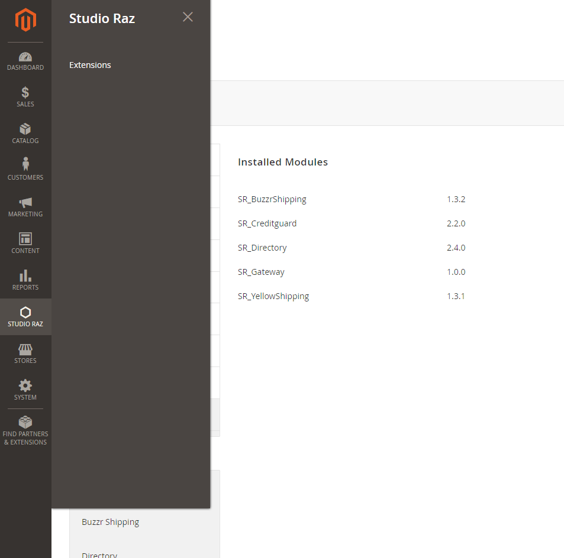
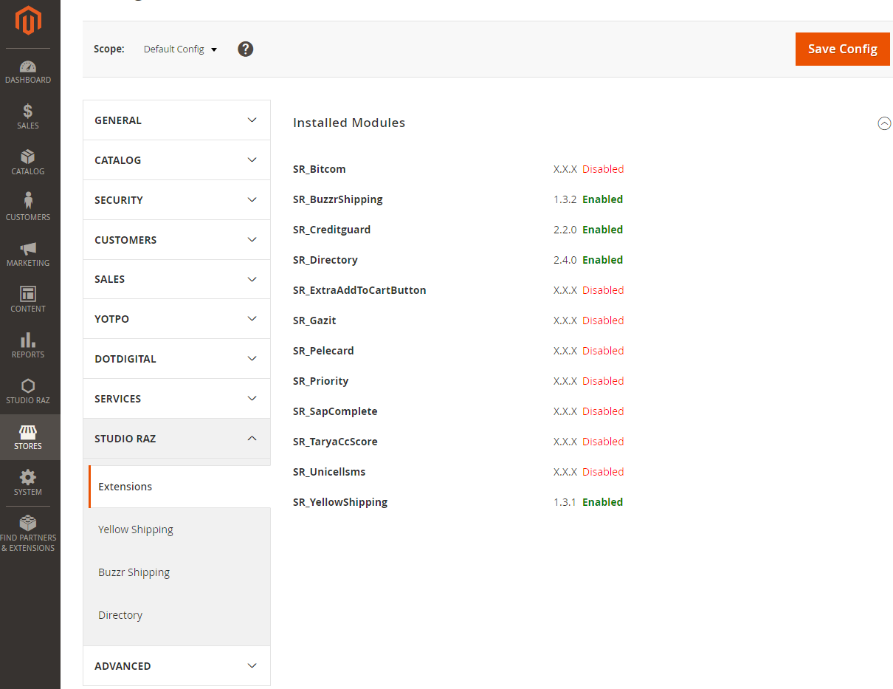

# Magento 2 module. Base module for Studio Raz's modules.
 
A base module for ALL Studio Raz modules. 

### Backen Menu
The module adds a menu item to allow dependent modules add their own links. 
When creating new menu item link in `etc/adminhtml/menu.xml` in order to append it to Studio Raz menu item set `parent="SR_Base::srbase"` 
```xml
<config>
    <menu>        
        <add ... parent="SR_Base::srbase" ... />
    </menu>
</config>
```



### System Configuration Tab
The module adds a system configuration tab that other dependent modules can hook to.
When creating a new system configuration section in `etc/adminhtml/system.xml` in order to append it to Studio Raz tab add `<tab>studioraz</tab>` to it:
```xml
<config>
    <system>
        <section>
            ...
            <tab>studioraz</tab>
            ....
        </section>
    </system>
</config> 
```

